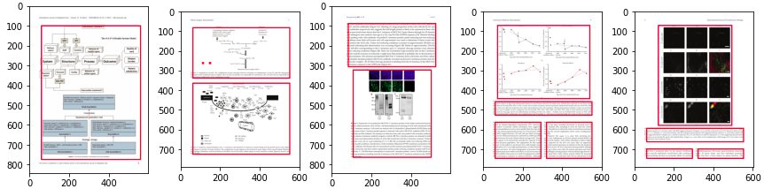

# OCR Layout Detection
 

 
## Подход:
Задачу можно сформулировать как минимум двумя способами:
* как задачу детекции областей с текстом и с изображениями
* как задачу сегментации с последующим построением детекций
 
Из общих соображений кажется, что для блоков текста и изображений подход с сегментацией должен рабоать лучше, аналогичные соображения в статье [[1]](https://link.springer.com/chapter/10.1007/978-3-319-95957-3_30).  
Базовую модель собрал по мотивам статьи [[1]](https://link.springer.com/chapter/10.1007/978-3-319-95957-3_30) (DeepLabV3).  
Параметры модели и размер изображения выбирался так, чтобы разделение между полигонами в масках не пропадало при ресайзе к размеру выхода модели (в данном случае `(600, 400)` - размер входного изображения,`(76, 51)` - размер маски на выходе модели).  
Далее:
1. Привел аннотации в train и test к одинаковому виду (в train аннотация полигонов была нормирована на размер изображения, в test - аннотация в пикселях).
2. Использовал аугментации без искажений изображения, т-к желаемые границы полигонов всегда прямые.
3. Обучил модель с кросс энтропией в качестве функции потерь.
4. Посчитал IoU по маскам та тестовой выборке, отдельно для каждого класса.
5. Попробовал улучшить IoU с постобработкой диляцией и эрозией с квадратным ядром (не помогло).
6. Построил боксы по семантическим маскам.
 
Detection of text and images layout with DeepLabv3.
* [Ноутбук с обучением]("./train.ipynb").
* [Ноутбук с инференсом и метриками]("./report.ipynb").
* [Веса](https://drive.google.com/file/d/1K5vsi_Y6hiDlpyarJ8GysZ0IMkzXTGX0/view?usp=sharing).

